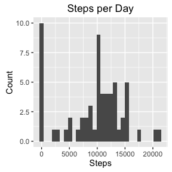
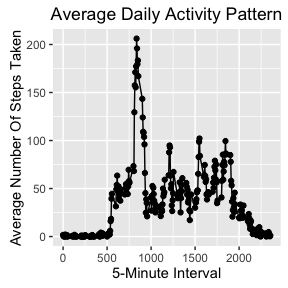
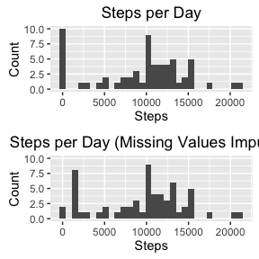
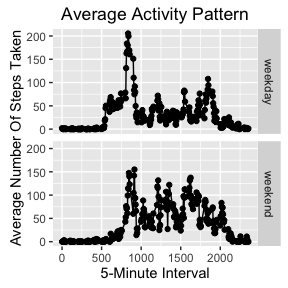

# Reproducible Research: Peer Assessment 1

# Course Project 1: "Reproducible Research" on Coursera
=======================================================

#### R Packages

The following R packages were loded into RStudio (messages and warnings outputted were hidden):


```r
library(dplyr)
library(ggplot2)
library(grid)
library(gridExtra)
```

#### Data Loading and Preparation

The dataset 'activity.csv' was loaded using the read.csv function, stored in a variabel called 'data' and the missing values were indicated as 'NA'.


```r
data <- read.csv('activity.csv', na.strings = 'NA')
```

The 'date' variabel is interpreted as a factor. In general it makes more sense to convert the 'date' variable to POSIXct format. Before doing this, we should take a look at some of the last rows of the data set to verify that the date format is YYYY-MM-DD:


```r
tail(data)
```

```
##       steps       date interval
## 17563    NA 2012-11-30     2330
## 17564    NA 2012-11-30     2335
## 17565    NA 2012-11-30     2340
## 17566    NA 2012-11-30     2345
## 17567    NA 2012-11-30     2350
## 17568    NA 2012-11-30     2355
```

```r
data$date <- as.POSIXct(data$date, format = '%Y-%m-%d') 
```

#### Part 1 of Assignment: Steps per Day (ignoring missing values)

For the first part of the assignment the sum, mean, and median of the total number of steps taken per day (missing values were ignored) was calculated:


```r
stepsperday <- data %>% group_by(date) %>% 
                summarize(sum = sum(steps, na.rm = TRUE), mean = mean(steps, na.rm = TRUE), median = median(steps, na.rm = TRUE))
stepsperday
```

```
## Source: local data frame [61 x 4]
## 
##          date   sum     mean median
##        (time) (int)    (dbl)  (dbl)
## 1  2012-10-01     0      NaN     NA
## 2  2012-10-02   126  0.43750      0
## 3  2012-10-03 11352 39.41667      0
## 4  2012-10-04 12116 42.06944      0
## 5  2012-10-05 13294 46.15972      0
## 6  2012-10-06 15420 53.54167      0
## 7  2012-10-07 11015 38.24653      0
## 8  2012-10-08     0      NaN     NA
## 9  2012-10-09 12811 44.48264      0
## 10 2012-10-10  9900 34.37500      0
## ..        ...   ...      ...    ...
```

Subsequently, a histogram of the total number of steps taken each day was made:


```r
plot1 <- ggplot(data = stepsperday, aes(x = sum)) +
         geom_histogram() +
         xlab('Steps') +
         ylab('Count') +
         ggtitle('Steps per Day')
plot1
```

```
## `stat_bin()` using `bins = 30`. Pick better value with `binwidth`.
```

<!-- -->

```r
ggsave(file='Plot1.png', width = 6.4, height = 6.4, unit = 'in')
```

```
## `stat_bin()` using `bins = 30`. Pick better value with `binwidth`.
```

#### Part 2 of Assignment: Average Daily Activity Pattern

In the second part of the assigmnent the average of steps for each interval was calculated (y-axis) and graphed over the 5-minute interval (x-axis) to visualize the average daily activity pattern.


```r
daypattern <- data %>% group_by(interval) %>% summarize(stepAvg = mean(steps, na.rm = TRUE))
daypattern <- data.frame(daypattern)
head(daypattern)
```

```
##   interval   stepAvg
## 1        0 1.7169811
## 2        5 0.3396226
## 3       10 0.1320755
## 4       15 0.1509434
## 5       20 0.0754717
## 6       25 2.0943396
```

Plotting the average daily activity patter:


```r
plot2 <- ggplot(data = daypattern, aes(x = interval, y = stepAvg)) +
        geom_line(aes(group = 1)) +
        geom_point() +
        xlab('5-Minute Interval') +
        ylab('Average Number Of Steps Taken') +
        ggtitle('Average Daily Activity Pattern')
plot2
```

<!-- -->

```r
ggsave(file='Plot2.png', width = 6.4, height = 6.4, unit = 'in')
```

The maximum naumber of steps on average across all days is:


```r
which.max(daypattern$stepAvg)
```

```
## [1] 104
```

#### Part 3 of Assignment: Imputing Missing Values

The data set contains a number of missing values that are coded as 'NA'. In the previous assignments, the missing values were ignored. To see if this introduced bias to the calculations, a new data set will be created with imputed missing values.

Total number of missing values in data set:


```r
nrow(data[!complete.cases(data),])
```

```
## [1] 2304
```

Percent of missing values in data set:


```r
mean(is.na(data))
```

```
## [1] 0.04371585
```

Copying the data into a new variable, so that in the end there will be the original data set and the data set with imputed missing values.


```r
nonNAdata <- data
```

The missing data is imputed by the median of steps for the 5-minute interval since the median is less affected by outliers.
To fill in the missing values, a for loop was created that is iterating through each row of the new data set. Each missing value is then replaced by the median of the steps for the interval.


```r
for(x in (0:nrow(nonNAdata))) {
        
        nonNAdata[is.na(nonNAdata$steps) & nonNAdata$interval == x, 'steps'] <- median(data[data$interval == x, 'steps'], na.rm = TRUE)
}
```

Checking the number of rows with missing vales:


```r
nrow(nonNAdata[is.na(nonNAdata),])
```

```
## [1] 0
```

As previously, the sum, mean, and median for each day are calculated:


```r
nonNAstepsperday <- nonNAdata %>% group_by(date) %>% 
        summarize(sum = sum(steps, na.rm = TRUE), mean = mean(steps, na.rm = TRUE), median = median(steps, na.rm = TRUE))
nonNAstepsperday
```

```
## Source: local data frame [61 x 4]
## 
##          date   sum      mean median
##        (time) (int)     (dbl)  (dbl)
## 1  2012-10-01  1141  3.961806      0
## 2  2012-10-02   126  0.437500      0
## 3  2012-10-03 11352 39.416667      0
## 4  2012-10-04 12116 42.069444      0
## 5  2012-10-05 13294 46.159722      0
## 6  2012-10-06 15420 53.541667      0
## 7  2012-10-07 11015 38.246528      0
## 8  2012-10-08  1141  3.961806      0
## 9  2012-10-09 12811 44.482639      0
## 10 2012-10-10  9900 34.375000      0
## ..        ...   ...       ...    ...
```

And the a new histogram without missing values is made right next to the one with missing values:


```r
plot3 <- ggplot(data = nonNAstepsperday, aes(x = sum)) +
        geom_histogram() +
        xlab('Steps') +
        ylab('Count') +
        ylim(0,10) +
        ggtitle('Steps per Day (Missing Values Imputed)')

plot3.1 <- grid.arrange(plot1, plot3)
```

<!-- -->

```r
plot3.1
```

```
## TableGrob (2 x 1) "arrange": 2 grobs
##   z     cells    name           grob
## 1 1 (1-1,1-1) arrange gtable[layout]
## 2 2 (2-2,1-1) arrange gtable[layout]
```

```r
ggsave(file='Plot3.1.png', width = 6.4, height = 6.4, unit = 'in')
```

The most striking difference between the two histograms are the counts at 0 steps. Otherwise, the differences are minor between the data sets.

#### Part 4 of Assignment: Differences in Activity Patterns between Weekdays and Weekends

To analyse the differences between the activity patterns of weekdays and weekends, a the variable was created indicating the weekday for each day.


```r
nonNAdata$weektype <- weekdays(nonNAdata$date)
```

Subsequently, a for loop was used to iterate throough each row of the data set and the weektype observations were replaced with either 'weekday' or 'weekend'.


```r
for(i in (1:nrow(nonNAdata))){
        
        nonNAdata[nonNAdata$weektype %in% c('Saturday', 'Sunday'), 'weektype'] <- 'weekend' 
        nonNAdata[nonNAdata$weektype %in% c('Monday', 'Tuesday', 'Wednesday', 'Thursday', 'Friday'), 'weektype'] <- 'weekday' 
}
```

Checking the number of rows of weekends and weekdas respectively (expecting more weekdays than weekends).


```r
nrow(nonNAdata[nonNAdata$weektype == 'weekend',])
```

```
## [1] 4608
```

```r
nrow(nonNAdata[nonNAdata$weektype == 'weekday',])
```

```
## [1] 12960
```

To further analyze the data, the weektype needs to be factorized.


```r
nonNAdata$weektype <- as.factor(nonNAdata$weektype)
```

As previously described, the average of steps for each interval was calculated (y-axis) and graphed over the 5-minute interval (x-axis) to visualize the average daily activity pattern.


```r
weekdaypattern <- nonNAdata %>% group_by(interval, weektype) %>% summarize(avgsteps = mean(steps))
weekdaypattern
```

```
## Source: local data frame [576 x 3]
## Groups: interval [?]
## 
##    interval weektype   avgsteps
##       (int)   (fctr)      (dbl)
## 1         0  weekday 2.02222222
## 2         0  weekend 0.00000000
## 3         5  weekday 0.40000000
## 4         5  weekend 0.00000000
## 5        10  weekday 0.15555556
## 6        10  weekend 0.00000000
## 7        15  weekday 0.17777778
## 8        15  weekend 0.00000000
## 9        20  weekday 0.08888889
## 10       20  weekend 0.00000000
## ..      ...      ...        ...
```

Plotting the average daily activity patter of weekdays and weekends:


```r
plot4 <- ggplot(data = weekdaypattern, aes(x = interval, y = avgsteps)) +
        geom_line(aes(group =1)) +
        geom_point() +
        facet_grid(weektype~.) +
        xlab('5-Minute Interval') +
        ylab('Average Number Of Steps Taken') +
        ggtitle('Average Activity Pattern')
plot4
```

<!-- -->

```r
ggsave(file='Plot4.png', width = 6.4, height = 6.4, unit = 'in')
```

Finally, we can see that during weekdays the activity peaks around the 100-minute interval followed by a few minor peaks. The weekend pattern of activity shows a smaler range of steps that are more equally distributed throughout the intervals.
